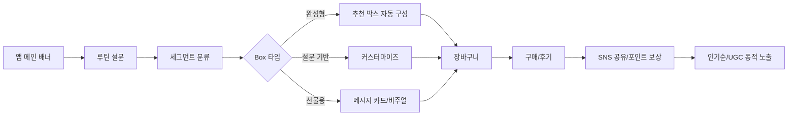

# 포트폴리오

김태성
이메일: xotjd878@gmail.com
전화: 010-8689-3007

### 프로젝트 개요

* **1) Netflix 고객 이탈 분석·예측 & 추천 연계**
  Kaggle 데이터 기반 이탈 예측(XGBoost)·상황별 타깃 유지 전략·추천(Surprise)까지 End-to-End 파이프라인
* **2) Kurly 라이프스타일·뷰티 이미지 전환 & 온사이트 마케팅**
  “식탁→일상” 신뢰 자산 확장, 루틴 큐레이션 캠페인( My Kurly Box ), 온사이트·SNS 연계
* **3) 옥외광고(OOH) 최적화 & 입지 점수화 모델**
  행정동 단위 인구/소비/시설/점포 데이터 통합, **광고효율 점수(0–100)** 산출 및 지도 시각화

> **주의**: 본 리포지토리는 *재현용 코드/구조*와 *보고서 양식*을 제공합니다. 외부 원천 데이터는 용량/저작권 이슈로 포함하지 않으며,
> 스크립트를 통해 사용자가 직접 다운로드/경로 지정하도록 구성합니다. 문서의 수치·결과는 **사용자 제공 요약**을 반영합니다.

### 환경/모델/툴

       

## `projects/netflix-churn/README.md`

# Netflix 고객 이탈 분석·예측 & 추천

**목표**: 글로벌 OTT 경쟁 심화 속 **이탈(Churn) 예측**과 **타깃 유지 전략** 수립, **개인화 추천**으로 리텐션 개선.

## 1. 배경 & 문제정의

* 2023\~2025 OTT 성장, 경쟁 다변화 → **이탈률 상승(참고: 사용자 제공 요약)**
* **핵심 질문**: 누가 이탈할까? 무엇이 영향 요인인가? 어떻게 붙잡을까(오퍼·추천·온사이트)?

## 2. 데이터

* **Kaggle**: `netflix_customer_churn` (예: 5,000명 × 11변수)
  주요 변수: `last_login_days`, `watch_hours`, `subscription_type`, `payment_method`, `Churned`
* (옵션) **IMDb/내부 시청 로그**로 추천 데이터 보강

> 📌 *루트 수준에서 원본 데이터는 포함하지 않습니다. 아래 스크립트로 경로만 지정하세요.*

```bash
# 예시: 데이터 위치 환경변수
export NETFLIX_DATA=./data/netflix/netflix_customer_churn.csv
```

## 3. EDA 요약(사용자 요약 반영)

* **시청시간↓** → 이탈 가능성↑
* **마지막 접속 경과일↑** → 이탈자 비율↑
* **Basic/비정기 결제군**에서 이탈률 상대적으로 높음

## 4. 모델링 (분류)

* 알고리즘: **XGBoost**
* **데이터 분할**: 학습 4,500 / 검증 500
* **보고된 성능**: 정확도 0.89 / 정밀도 0.88 / 재현율 0.90 *(사용자 제공 수치)*

### 실행 (예시)

```bash
python -m projects.netflix_churn.src.train_xgb \
  --data $NETFLIX_DATA \
  --target Churned \
  --test_size 500 \
  --model_out ./projects/netflix-churn/assets/xgb_model.json

python -m projects.netflix_churn.src.evaluate \
  --data $NETFLIX_DATA \
  --model ./projects/netflix-churn/assets/xgb_model.json
```

### 주요 변수 중요도(예상)

* `last_login_days`, `watch_hours`, `subscription_type`, `payment_method`

## 5. 추천 시스템 (협업/콘텐츠)

* 라이브러리: **Surprise (SVD)**
* 입력: (user, item, rating)
* 출력: **고객별 TOP10 추천** *(예: 쇼생크 탈출, 포레스트 검프, 다크나이트, 매트릭스 등 — 예시 타이틀)*

```bash
python -m projects.netflix_churn.src.recommend \
  --ratings ./data/netflix/imdb_ratings_sample.csv \
  --user_id 12345 \
  --topk 10
```

## 6. 전략 연결 (세그먼트별 오퍼)

| 이탈 유형            | 특징                     | 액션                      |
| ---------------- | ---------------------- | ----------------------- |
| **30일+ 미접속**     | last\_login\_days ≥ 30 | 리마인드 푸시/이메일 + 구독할인 테스트  |
| **시청시간 하락**      | watch\_hours 감소 추세     | 개인화 추천/큐레이션, 테마 묶음 프로모션 |
| **Basic/비정기 결제** | 요금제/결제특성               | 자동결제 유도, 업그레이드 인센티브     |

## 7. 노트북 & 코드

* `notebooks/netflix/01_eda.ipynb` — 분포/상관/변수 중요도
* `notebooks/netflix/02_train_xgb.ipynb` — 학습/튜닝
* `notebooks/netflix/03_reco_surprise.ipynb` — 추천 실험
* `src/train_xgb.py`, `src/evaluate.py`, `src/recommend.py`

## 8. 재현 절차 (Step-by-step)

1. 데이터 경로 환경변수 설정
2. `01_eda.ipynb` 실행 → 이상치/결측 처리
3. `train_xgb.py` 또는 `02_train_xgb.ipynb`로 모델 학습
4. `evaluate.py`로 검증 메트릭 확인
5. `recommend.py`로 사용자별 추천 TOP10 산출
6. 세그먼트별 액션 플랜(A/B 테스트) 연결

---

## `projects/kurly-lifestyle-beauty/README.md`

# Kurly 라이프스타일·뷰티 전환 & 온사이트 마케팅

**목표**: “좋은 것을 선별하는 신뢰”를 **식탁→일상 전체**로 확장. 3040 여성 루틴/구매 패턴 분석을 통한 **뷰티 신규 유입·재구매 증대**.

## 1. 시장/배경 스냅샷(사용자 요약 반영)

* 뷰티컬리(2022 런칭) · 2024 상반기 거래액 약 5,000억, 럭셔리 뷰티 매출↑
* 2023 거래액 내 뷰티 비중 \~11%
* 고객 인식: “컬리는 음식” → **뷰티 전환 장벽** 존재, *이벤트 후 첫 체험 비율 높음*

## 2. 핵심 문제 & 인사이트

* 장점: **큐레이션·신뢰** vs 전환 부족
* **루틴 중심 제안**(단품이 아닌 *My Kurly Box*), **푸드↔뷰티 연계**, **맞춤·DIY** 경험 강조

## 3. 캠페인: **Kurly Life Week & My Kurly Box**



## 4. 온사이트 구현 플로우

* 개인화 영역: 설문→세그먼트→추천 박스 → A/B Test (가격/구성/카피)
* 추천 로직: 최근 구매/장바구니/조회 + 시즈널리티 + 뷰티 루틴 태그
* 리텐션: 후기·리뷰 인센티브, SNS 공유 포인트, 구독 박스 파일럿

## 5. 타깃 & 페르소나(예시)

* **3040 여성**: 리뷰·검증 중심, 합리적/실용적, 건강·뷰티 루틴 중시
* 경로: 카페/블로그·TV/홈쇼핑·가격비교·후기이벤트

## 6. KPI

* **브랜드 재포지셔닝 지표**(인지/연상), **뷰티 탭 유입률**, **뷰티 거래액 비중(목표 25%)**, **재구매율**

## 7. 분석/데이터 파이프라인(예시)

```sql
-- 월 Cohort별 뷰티 첫구매 & N+1 재구매율
WITH first_buy AS (
  SELECT user_id, MIN(order_date) AS first_dt
  FROM orders
  WHERE category = 'beauty'
  GROUP BY user_id
), rebuy AS (
  SELECT o.user_id, COUNT(*) AS n_orders
  FROM orders o
  JOIN first_buy f USING(user_id)
  WHERE o.order_date > f.first_dt AND category='beauty'
  GROUP BY 1
)
SELECT PERCENTILE_CONT(0.5) WITHIN GROUP(ORDER BY n_orders) AS p50_reorders
FROM rebuy;
```

## 8. 콘텐츠/크리에이티브

* 임직원·인플루언서 **My Kurly Box 언박싱**, 진정성 리뷰, 릴스/쇼츠 시리즈
* **선물용 박스**: 카드/패키징 가이드(assets/)

## 9. 재현 절차 (Step-by-step)

1. 분석용 샘플 테이블 또는 CSV 배치
2. `notebooks/kurly/`의 `EDA`, `세그먼트`, `A/B 설계` 노트북 실행
3. 온사이트 추천 규칙·실험안 문서(`docs/flows.md`) 확정
4. 대시보드(KPI) 템플릿 연결

---

# OOH 옥외광고 최적화 & 입지 점수화

**목표**: 서울 425개 행정동의 **인구/소비/시설/점포**를 통합해 \*\*광고효율 점수(0–100)\*\*를 산출,
브랜드·타깃별 최적 위치/동선 추천 및 지도 시각화 제공.

## 1. 데이터 & 변수(예시)

* `LOCAL_PEOPLE_DONG.csv`, 생활인구/이동, 소득/소비, 집객시설(학교/병원/교통), 점포(음식/카페/의류/미용/자동차 등)
* 전처리 가이드: 0–6시/60세+ 제외, 결측 보정, 월평균 변환, 행정동 매핑

## 2. 점수화 모델

* 가중치 예: **인구 40 / 소비 10 / 시설 20 / 점포 30 (=100)**
* 스케일링→가중합→정규화(0–100) → 타깃 가중치(선택)

## 3. 지도 시각화(예시)


## 4. 캠페인 전략 연결(요약)

* **입지 최적화**: 현 위치 vs 추천 위치 **효율차** 비교 리포트
* **동선 타게팅**: 출발지/목적지 상위 행정동 반복 노출(정류장/대학 출입문/환승구간)
* **예산 시뮬**: 예산별 상위 n개 존 선택·도달률/빈도 예측

## 5. 재현 절차 (Step-by-step)

1. `merged_features.csv` 생성: 인구/소비/시설/점포 통합
2. `score.py` 실행 → `scored.csv` 산출
3. `map.py` 실행 → `map.html` 시각화
4. 브랜드·타깃별 가중치 튜닝 및 리포트 자동생성

---

## 공통 파일 샘플

### `requirements.txt`

```
pandas
numpy
scikit-learn
xgboost
surprise
matplotlib
seaborn
jupyter
selenium
beautifulsoup4
geopandas
folium
shapely
branca
prophet
python-dotenv
```

### `.gitignore`

```
# python
.venv/
__pycache__/
*.pyc

# data
/data/
/projects/**/assets/*.csv
/projects/**/assets/*.json
/projects/**/assets/*.html

# notebooks
.ipynb_checkpoints/
```

### `docs/REPORT_TEMPLATE.md`

```
# 프로젝트 리포트 템플릿

## 1. 배경/목표
## 2. 데이터 & 방법
## 3. 핵심 결과(표/그래프)
## 4. 비즈니스 인사이트
## 5. 한계 & 후속 과제
```

### 이슈/작업 템플릿 (`.github/ISSUE_TEMPLATE/feature.md`)

```
---
name: Feature request
about: 제안/작업 요청
---
**배경**
**할 일**
- [ ]
**완료 조건**
```

---

## 업로드 가이드

1. 본 캔버스의 마크다운을 복사해 깃허브의 루트 `README.md`에 붙여넣습니다.
2. 각 섹션의 코드를 `projects/*/` 경로에 파일로 생성합니다.
3. 데이터 경로/환경변수만 맞춰 실행 후 결과물을 `assets/`에 저장합니다.
4. 필요 시 `docs/` 템플릿으로 제안서/PPT를 생성합니다.

> 필요하면, 위 구조를 실제 파일 세트로 내보내도록(폴더·파일 자동 생성) 스크립트도 제공해 드릴 수 있습니다.
